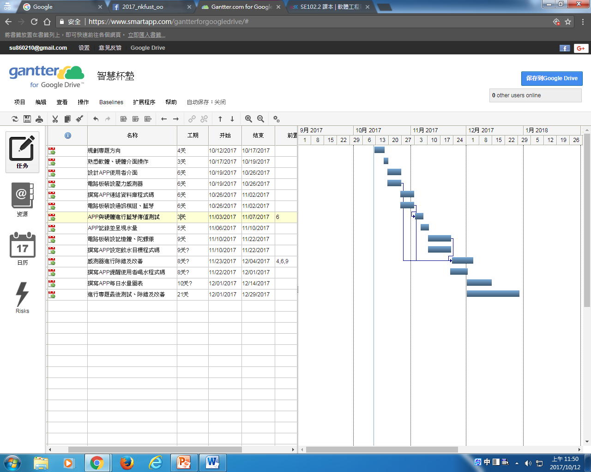

# 智慧杯墊 第10組
## 專題成員:0424013 廖育滺 0424020 陳怡婷  0424023 林欣平 0424095 楊東瑾
## 指導老師:張弘毅
#### A.專題內容:利用感測器連結藍芽至手機APP，可以得知使用者攝取的水量以及提醒使用者喝水。
#### B.專題需要:水的補充是一件很重要的事，但現代人生活忙碌，經常會忘記要喝水，或者今日水量攝取不夠而不自知。
#### C.專題效益:使用者可以設定提醒喝水的時間、飲水目標，也能夠記錄攝取的水量進而掌握飲水習慣、促進健康。
#### D.功能性:1.記錄攝取水量。2.自行設定飲水目標。3.提醒用戶喝水。
#### D.非功能性:操作性-輕巧、可攜帶、系統易上手。效能-如果連上藍芽可即時回報。

甘特圖

