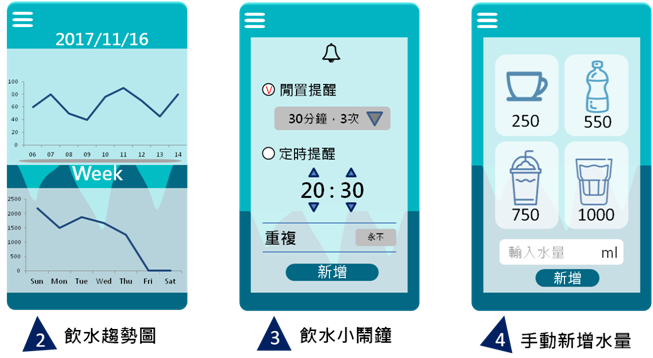

# 智慧杯墊 第10組
## 專題成員:0424013 廖育滺 0424020 陳怡婷  0424023 林欣平 0424095 楊東瑾
## 指導老師:張弘毅
#### 1.專題動機:水的補充是一件很重要的事，但現代人生活忙碌，常常因為要讀書或是工作而忘記要喝水或者水量攝取不夠而不自知。
#### 2.專題內容:為解決這個喝水的問題，我們想出了以杯墊結合App的方式，利用感測器連結藍芽至手機APP，使用者可以藉由水量差來得知已攝取的水量以及設定提醒喝水時間。
#### 3.專題效益:使用者可以設定提醒喝水的時間、記錄攝取的水量，進而掌握飲水習慣、促進健康。
#### 4.需求:
##### 功能性需求:1.記錄攝取水量。2.提醒用戶喝水。3.杯墊顯示燈。
##### 非功能性需求:1.操作性-輕巧、可攜帶、系統易上手。2.效能-如果連上藍芽可即時回報。
#### 5.使用案例圖:

#### 6.使用工具:
##### 1.軟體:android studio 
##### 2.硬體:arduino leonardo、重量感測器、藍芽模組、電池模組
#### 7.作業程序:

#### 8.APP畫面:

#### 9.甘特圖:

